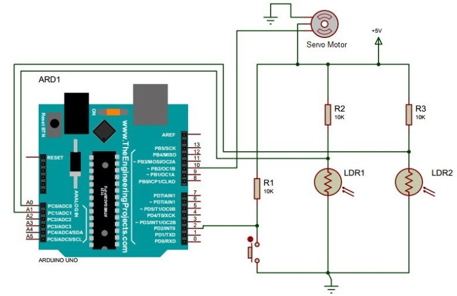

# Solar Movement Tracker

This is a Single axis solar tracking system. In this system, the whole solar panel moves from east to west in a day to point in the direction of the sun. Use of a solar tracker circuit in the field of energy production will increase its efficiency. This system can also be successfully implemented in other solar energy based projects like water heaters and steam turbines.
### Components:
1. Solar Panel
2. Arduino Microcontroller
3. LDR Sensors
4. Servo Motor
### Here's the cricuit diagram of the project:

### How it works:
The LDRs serve as the sensors to detect the intensity of light entering the solar panels. The LDR then sends information to the Arduino microcontroller. The obstacle in between the two LDRs is creates a difference in intensity of light on each LDR sensor. This difference is then used to calculate the degree by which the servo moter needs to rotate to minimize the difference. 

